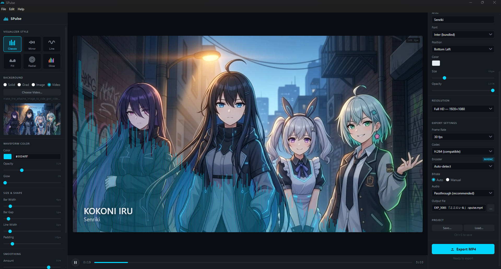

# SPulse

[](https://github.com/senriki/SPulse/releases/latest)
[](./LICENSE)
[](https://github.com/senriki/SPulse/releases)
[](https://github.com/senriki/SPulse/actions/workflows/ci.yml)

Desktop app for creating MP4 waveform visualizer videos from audio files. Runs fully offline.



Built with Electron, Web Audio API, Canvas 2D, and FFmpeg.

---

## Requirements

- Node.js 18+
- npm 9+
- A display (Windows or macOS host; WSL2 headless is not supported)

## Getting Started

```bash
npm install
make run
```

## Commands

| Command | Description |
|---|---|
| `make run` | Start the app in development mode |
| `make install` | Install dependencies |
| `make build` | Package for the current platform |
| `make build-win` | Build Windows installer (.exe via NSIS) |
| `make build-win-portable` | Build Windows portable .exe (no install needed, good for quick testing) |
| `make build-mac` | Build macOS disk image (.dmg) |
| `make build-linux` | Build Linux AppImage |
| `make clean` | Remove `dist/` and `out/` build artifacts |

Output is written to `dist/`.

---

## Features

- **Import**: MP3, WAV, FLAC, AAC, OGG, M4A — drag-and-drop or Ctrl+O
- **6 visualizer styles**: Classic Bar, Mirror Bar, Smooth Line, Filled Wave, Radial Pulse, Spectrum Glow
- **Drag to reposition**: click and drag the visualizer directly on the canvas to adjust its vertical position — syncs with the Y Offset slider in the panel
- **Backgrounds**: solid color, linear gradient, static image (with blur/darken), looping video — thumbnail preview appears in the panel immediately after selecting a file
- **Text overlay**: title + artist, 5 positions, custom XY, font/size/color/opacity
- **Export**: MP4 via FFmpeg — Full HD, 4K, Shorts/Reels (9:16), Square (1:1), or custom resolution; 24/30/60 fps; H.264 or H.265; hardware-accelerated encoding via NVIDIA NVENC, AMD AMF, or Intel QSV (auto-detected, with manual override)
- **Project save/load**: `.spx` JSON format preserves all settings and the audio file path
- **Undo/redo**: 20-step history for visualizer style changes (Ctrl+Z / Ctrl+Y)
- **Auto-update**: checks GitHub Releases on startup and downloads updates in the background; a banner appears when a new version is ready to install

## Keyboard Shortcuts

| Shortcut | Action |
|---|---|
| `Ctrl+O` | Open audio file |
| `Space` | Play / Pause |
| `Ctrl+E` | Start export |
| `Ctrl+S` | Save project |
| `Ctrl+Z` | Undo |
| `Ctrl+Y` | Redo |
| `Ctrl+Q` | Quit |
| `Escape` | Close modal |

---

## Known Issues & Tips

### Windows: SmartScreen warning on install

The installer is not code-signed, so Windows SmartScreen will show an "Unknown publisher" warning the first time it runs. Click **More info → Run anyway** to proceed. The warning disappears over time as more users install the app and Microsoft builds reputation for the binary.

To eliminate the warning permanently, a paid code signing certificate (OV or EV) from a CA such as DigiCert or Sectigo is required.

### Windows: export blocked by Controlled Folder Access

Windows Defender's **Ransomware protection → Controlled folder access** blocks apps from writing to protected folders (Desktop, Documents, Pictures, etc.). If export fails silently or with a permissions error, either:

1. Choose an output folder outside the protected list (e.g. a subfolder you created in `C:\Users\<you>\Videos`)
2. Or whitelist SPulse: **Windows Security → Virus & threat protection → Ransomware protection → Allow an app through Controlled folder access → Add SPulse**

---

## Packaging

Before running `make build`, place app icons in `build/`:

```
build/icon.ico    — Windows  (256×256 multi-resolution ICO)
build/icon.icns   — macOS    (1024×1024 ICNS)
build/icon.png    — Linux    (512×512 PNG)
```

See `build/README.md` for icon creation instructions.

Installer size target: < 250 MB. The bundled FFmpeg binary (~50–80 MB depending on platform) is the largest single component.

### Releases

Stable builds are tagged `vX.Y.Z` and published as the "Latest Release" on GitHub. Release candidates are tagged `vX.Y.Z-rc.N` and published as pre-releases (amber app icon, distinct from stable's cyan) so they can be tested without affecting auto-update for stable users. See `AGENTS.md` → Release Flow for the full tagging process.

---

## Contributing

Want to help? See [`CONTRIBUTING.md`](./CONTRIBUTING.md) for dev setup, code style, commit conventions, and how to submit a PR.

---

## License

MIT — see individual dependency licenses for FFmpeg (LGPL v2.1+), Inter (SIL OFL 1.1), and JetBrains Mono (Apache 2.0).

The app's Help > About screen lists all open-source component licenses as required by the FFmpeg LGPL.
